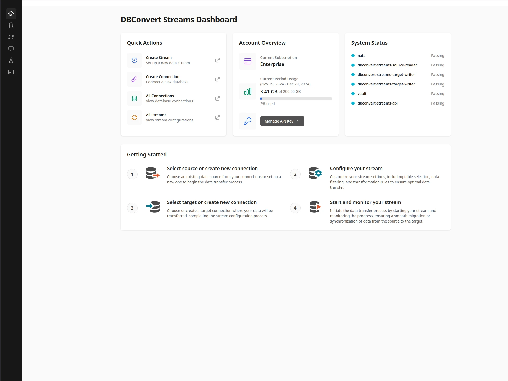
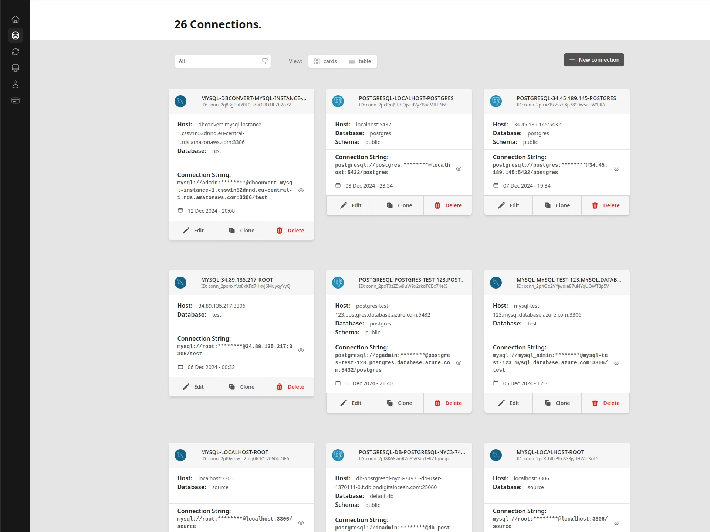
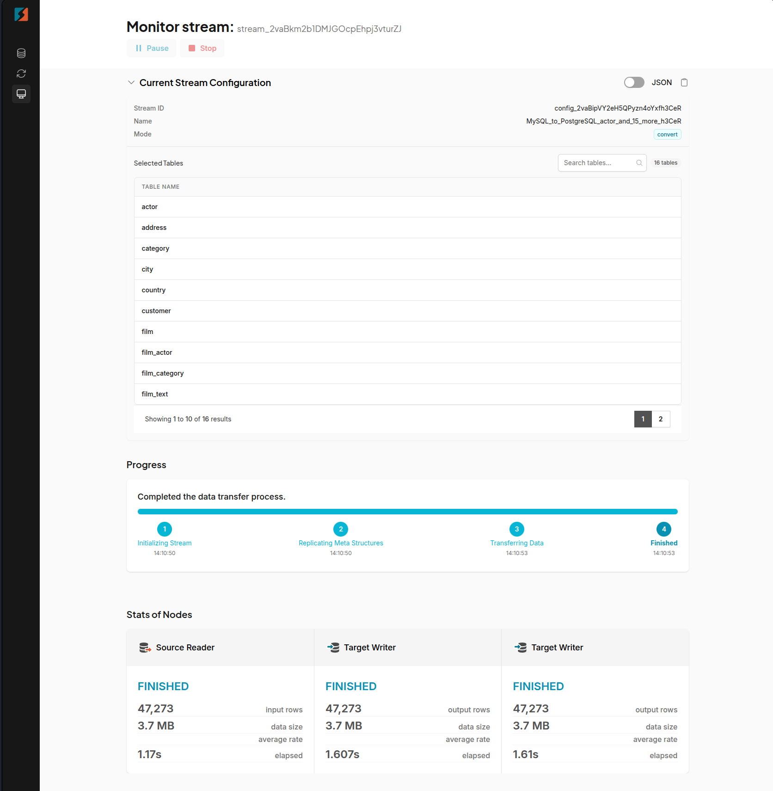

<p align="center">
  
</p>

# DBConvert Streams: Real-time Database Replication and Migration

A distributed platform for seamless data migration and real-time replication between database systems. Designed for high performance, reliability, and ease of use.

> **Note:** This is a public repository for example configurations, documentation, and issue tracking. The core backend code of DBConvert Streams is proprietary, while the frontend UI is open source and available at [github.com/slotix/dbconvert-streams-ui](https://github.com/slotix/dbconvert-streams-ui).

## Quick Start

Get started in minutes with our one-line installer:

```bash
curl -fsSL https://dbconvert.nyc3.digitaloceanspaces.com/downloads/streams/latest/docker-install.sh | sh
```

## What is DBConvert Streams?

[DBConvert Streams](https://streams.dbconvert.com) is a powerful distributed platform for data migration between heterogeneous databases and real-time data replication. It seamlessly transfers data between on-premises or cloud databases, including relational databases and data warehouses.

### Operating Modes

1. **Data Migration (Convert Mode)**
   Efficiently transfer data between databases with optimized performance and full structure mapping.

2. **CDC (Change Data Capture) Mode**
   Stream changes from source to target database in real-time, capturing all `INSERT`, `UPDATE`, and `DELETE` operations with minimal latency.

## Key Features

- **Modern Dashboard UI** - Comprehensive monitoring and management interface
- **One-Click Deployment** - Rapid installation on all major cloud platforms
- **Advanced Monitoring** - Real-time metrics and comprehensive system health visibility
- **Schema Management** - Automated schema mapping and evolution handling
- **High Performance** - 50 million records (150 GB) transferred in ~20 minutes with speeds up to 120 MB/s
- **Enterprise Security** - Built-in encryption, access controls, and security compliance

## Dashboard UI Screenshots

The DBConvert Streams dashboard provides a modern, intuitive interface for managing your entire data migration and replication workflow. With its comprehensive monitoring capabilities and streamlined operation, you can efficiently control all aspects of your data streams.

### Quick Deploy Options

The DBConvert Streams dashboard provides a centralized interface for managing your data streams and monitoring system status.



### Connection Management
Easily configure and manage database connections through our visual interface. Create, edit, and test connections with support for advanced options like SSL/TLS configuration and custom parameters:



### Real-time Monitoring
Track your data streams with detailed real-time metrics. The monitoring dashboard provides comprehensive insights into transfer rates, progress, and system performance with visual indicators for each stage of the process:



## Blazing Speed

> DBConvert Streams, the speedster of database migration tools, raced through the latest performance tests with finesse. Picture this: 50 million records, around 150 GB of data, zooming from MySQL to Postgres in just over 20 minutes. And here's the cherry on top—speeds reaching up to 120 Mb per second. Brace yourself for unparalleled efficiency in your database migration and replication processes!


## Deployment Options

### Quick Deploy

Choose your preferred deployment method:

#### Docker Installation (Recommended)
Use our one-line installer for instant setup:
```bash
curl -fsSL https://dbconvert.nyc3.digitaloceanspaces.com/downloads/streams/latest/docker-install.sh | sh
```

#### Cloud Deployment
Deploy on your preferred cloud platform:

**Enterprise Options:**
- Amazon Web Services (AWS)
- Google Cloud Platform (GCP)
- Microsoft Azure

**Standard Options:**
- DigitalOcean
- Vultr
- Hetzner Cloud

Visit our [documentation](https://docs.dbconvert.com/deployment/docker.html) for detailed deployment instructions.

## Supported Databases

- MySQL
- MariaDB
- Percona
- PostgreSQL
- CockroachDB
- Amazon RDS for MySQL
- Amazon Aurora (MySQL Compatible)
- Amazon RDS for PostgreSQL
- Amazon Aurora (PostgreSQL Compatible)
- Google Cloud SQL
- Azure Database

## Supported Operating Systems

- Ubuntu
- Debian
- CentOS
- RHEL
- Fedora
- Windows
- macOS 

## Learn More

- [Dashboard UI Guide](https://docs.dbconvert.com/guide/dashboard-ui-guide.html)
- [Technical Documentation](https://docs.dbconvert.com)
- [What's New](https://streams.dbconvert.com/whats-new)

## Feedback and Support

Your feedback matters! If you have any questions or comments, feel free to open an issue in this repository.

[Contact our support team](https://streams.dbconvert.com/contact) for enterprise assistance.
