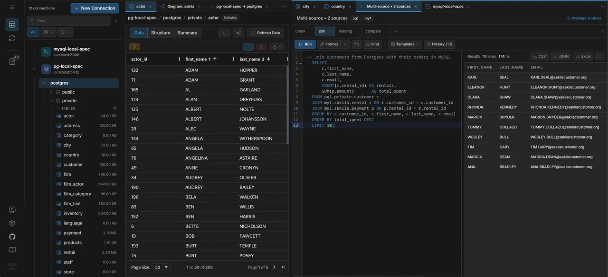
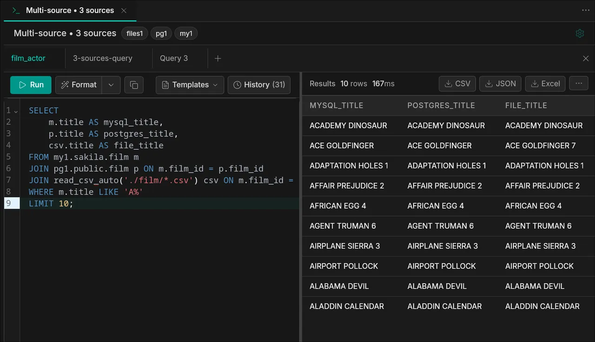
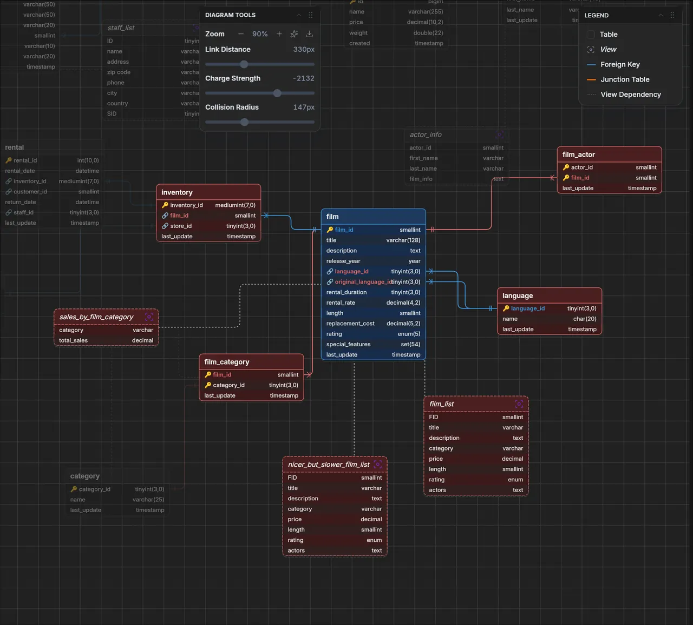
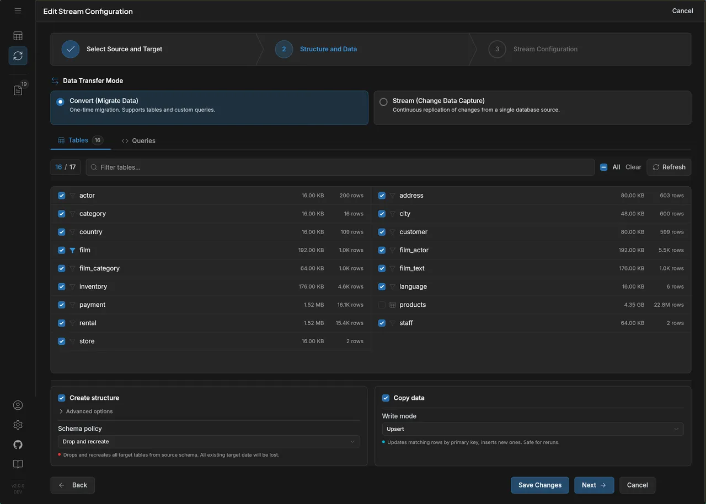
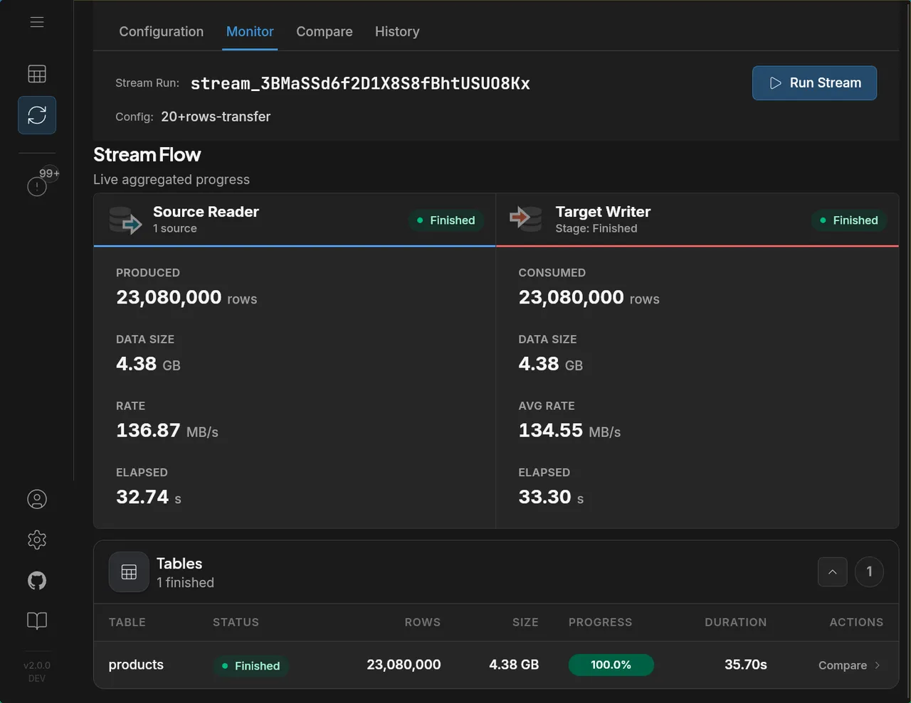

<p align="center">
  
</p>

# DBConvert Streams 2.0

Database IDE + migration + real-time CDC — in one workflow.

Query data,<br>
move it,<br>
keep it in sync

without switching between tools.

If this looks useful, consider giving it a ⭐

---

### Why this exists

Most setups look like this:

- a DB client for queries
- scripts or tools for migration
- a separate CDC pipeline

It works, but it's fragmented.

DBConvert Streams combines these into one workspace.

---

### What it feels like

Think of it as:

DBeaver / DataGrip<br>
+ migration tool<br>
+ CDC

but without switching tools every time

---

### Example

Run queries across databases and files:

```sql
SELECT *
FROM read_parquet('orders.parquet') o
JOIN postgres.public.customers c
  ON o.customer_id = c.id
LIMIT 10;
```

Then use the same query as a data source — and stream it anywhere.

---

### What you can do

- explore databases, files, and S3
- run SQL across multiple sources
- move data between systems
- keep it in sync with CDC

All in the same workflow.

> **Note:** This is a public repository for example configurations, documentation, and issue tracking. The core backend code of DBConvert Streams is proprietary, while the frontend UI is open source and available at [github.com/slotix/dbconvert-streams-ui](https://github.com/slotix/dbconvert-streams-ui).

## Quick Start

Runs anywhere — your laptop, a VPS, or your own infra. No cloud dependency, no vendor lock-in.

### Desktop App

[Download](https://streams.dbconvert.com/download) for Windows, macOS, or Linux — no account required.

### Self-Hosted (Docker)

Deploy on any machine with Docker — a local server, a VPS (DigitalOcean, Hetzner, AWS EC2, etc.), or your own infrastructure:

```bash
curl -fsSL https://dbconvert.nyc3.digitaloceanspaces.com/downloads/streams/latest/docker-install.sh | sh
```

## What is DBConvert Streams?

[DBConvert Streams](https://streams.dbconvert.com) is a database IDE with built-in migration and real-time CDC.

Browse databases, local files, and S3 storage. Edit data directly. Run federated SQL queries that join tables across different database engines — no intermediate exports needed.

## Key Features

In practice, it comes down to this:

### Database IDE & Workspace (Free)
- **Data Explorer** — Browse databases, files, and S3 in one place
- **ER Diagrams** — Visualize database relationships
- **Schema Comparison** — Compare schemas and data across databases
- **Schema Navigation** — Persistent state and search across connections

### Federated SQL
- Execute SQL queries across multiple databases and file sources simultaneously
- Join live PostgreSQL and MySQL tables using connection aliases
- Query CSV, JSON, Parquet files and S3 storage alongside databases

### Data Migration (Load Mode)
Rapidly move large datasets between databases with automatic schema conversion and validation.

> **Performance:** 23 million rows (4.38 GB) migrated from MySQL to Parquet in 35.7 seconds at 136 MB/s.

### Real-time CDC (Change Data Capture)
Stream `INSERT`, `UPDATE`, and `DELETE` operations from source to target in real-time with minimal latency. Supports CDC to databases, files, and S3 storage.

## When this is probably not for you

- you need 100+ connectors (SaaS, APIs, etc.)
- you already run Kafka pipelines at scale
- you need complex ETL / transformations

## Screenshots

### Data Explorer
Browse schemas, view and edit data across multiple database connections with a unified tree navigation:



### Federated SQL
Join tables across MySQL, PostgreSQL, and file sources (CSV, Parquet) in a single query:



### ER Diagrams
Visualize database relationships with interactive entity-relationship diagrams:



### Stream Configuration
Configure data migration and CDC streams with table selection, custom queries, and transfer settings:



### Stream Monitoring
Track data streams with real-time metrics — rows, data size, transfer rates, and per-table progress:



## Supported Sources & Targets

### Sources
- MySQL / MariaDB / Percona
- PostgreSQL / CockroachDB
- Amazon RDS, Aurora, Google Cloud SQL, Azure Database
- Local files (CSV, JSONL, Parquet)
- S3-compatible storage (AWS S3, MinIO, DigitalOcean Spaces, Wasabi)

### Targets
- MySQL / PostgreSQL
- Snowflake
- CSV / JSONL / Parquet (local files)
- Amazon S3 / MinIO / S3-compatible storage
- Google Cloud Storage (GCS)
- Azure Blob Storage

## Deployment Options

Run it anywhere — no cloud account required, no vendor lock-in.

| Method | Description |
|--------|-------------|
| **Desktop** | Windows, macOS, Linux — local setup, no account required |
| **Self-hosted** | Docker / Docker Compose on any machine — local server, VPS, or your own infra |

## Pricing

The Database IDE is **free forever**. For data migration and CDC streaming, see [pricing details](https://streams.dbconvert.com/pricing).

## Examples

> **Most people never touch the API.** The UI covers connections, table selection, federated SQL, stream configuration, and monitoring end-to-end. The `curl` examples below are for users who want to script deployments, wire DBConvert Streams into CI/CD, or drive it from another service — not a required workflow.

Connections are managed separately and stream configs reference them by ID. Here are typical workflows via the API.

### 1. Create connections

```bash
# Create a MySQL source connection
curl -X POST http://localhost:8020/api/v1/connections \
  -H "Content-Type: application/json" \
  -d '{
    "name": "mysql-source",
    "type": "mysql",
    "host": "localhost",
    "port": 3306,
    "username": "root",
    "password": "password"
  }'

# Create a PostgreSQL target connection
curl -X POST http://localhost:8020/api/v1/connections \
  -H "Content-Type: application/json" \
  -d '{
    "name": "pg-target",
    "type": "postgresql",
    "host": "localhost",
    "port": 5432,
    "username": "postgres",
    "password": "password"
  }'
```

### 2. MySQL → PostgreSQL (load)

One-time migration with table selection:

```json
{
  "name": "mysql-to-postgres-migration",
  "mode": "load",
  "source": {
    "connections": [{
      "connectionId": "<mysql-connection-id>",
      "database": "sakila",
      "tables": [
        { "name": "actor" },
        { "name": "film" },
        { "name": "customer" }
      ]
    }]
  },
  "target": {
    "id": "<pg-connection-id>",
    "spec": {
      "db": {
        "database": "target_db",
        "schema": "public",
        "schemaPolicy": "drop_and_recreate"
      }
    }
  }
}
```

### 3. MySQL → PostgreSQL (CDC)

Real-time replication capturing inserts, updates, and deletes:

```json
{
  "name": "mysql-to-postgres-cdc",
  "mode": "cdc",
  "source": {
    "connections": [{
      "connectionId": "<mysql-connection-id>",
      "database": "sakila",
      "tables": [
        { "name": "actor" },
        { "name": "film" }
      ]
    }],
    "options": {
      "operations": ["insert", "update", "delete"]
    }
  },
  "target": {
    "id": "<pg-connection-id>",
    "spec": {
      "db": {
        "database": "target_db",
        "writeMode": "upsert"
      }
    }
  }
}
```

### 4. PostgreSQL → S3 Parquet (load)

Export database tables to Parquet files on S3:

```json
{
  "name": "pg-to-s3-parquet",
  "mode": "load",
  "source": {
    "connections": [{
      "connectionId": "<pg-connection-id>",
      "database": "analytics",
      "tables": [
        { "name": "orders" },
        { "name": "customers" }
      ]
    }]
  },
  "target": {
    "id": "<s3-connection-id>",
    "spec": {
      "s3": {
        "fileFormat": "parquet",
        "upload": {
          "bucket": "my-data-lake",
          "prefix": "exports/"
        }
      }
    }
  }
}
```

### 5. Multi-source federated query (load)

Join data from MySQL and PostgreSQL into one target:

```json
{
  "name": "federated-migration",
  "mode": "load",
  "source": {
    "connections": [
      {
        "alias": "my1",
        "connectionId": "<mysql-connection-id>",
        "database": "sakila"
      },
      {
        "alias": "pg1",
        "connectionId": "<pg-connection-id>",
        "database": "dvdrental"
      }
    ]
  },
  "target": {
    "id": "<target-connection-id>",
    "spec": {
      "db": { "database": "warehouse" }
    }
  }
}
```

### 6. Start a stream

```bash
curl -X POST http://localhost:8020/api/v1/stream-configs/<config-id>/start
```

### 7. Monitor progress

```bash
curl http://localhost:8020/api/v1/streams/<stream-id>/stats
```

> See the full [API documentation](https://streams.dbconvert.com/docs/) for all endpoints and options. Standalone stream-config files live in [`examples/api/`](examples/api/), and reproducible benchmarks (including a side-by-side vs Debezium) are in [`examples/benchmarks/`](examples/benchmarks/).

## Learn More

- [Documentation](https://streams.dbconvert.com/docs/)
- [What's New in 2.0](https://streams.dbconvert.com/blog/dbconvert-streams-2-0/)

## Feedback and Support

Have questions or feedback? Use [Discussions](https://github.com/slotix/dbconvert-streams-public/discussions) or open an [Issue](https://github.com/slotix/dbconvert-streams-public/issues).
