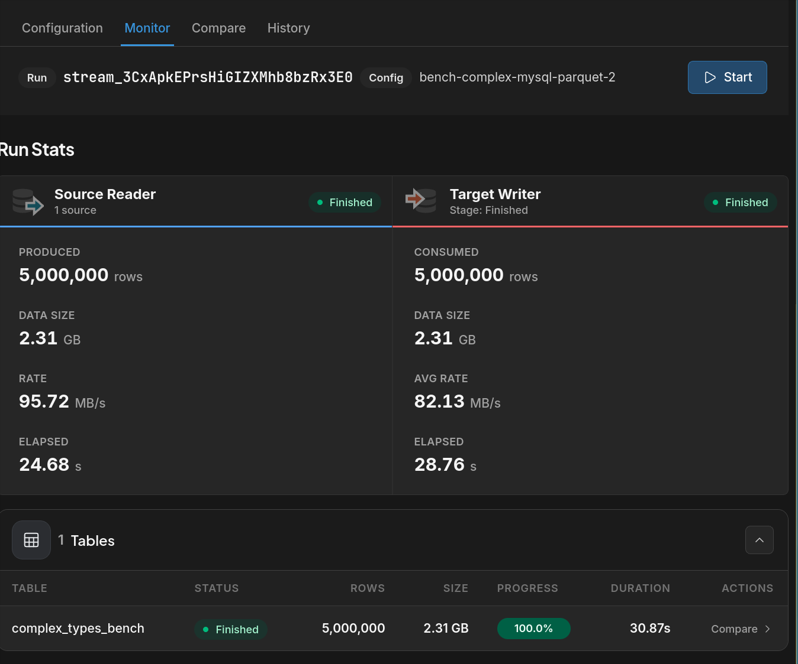

# MySQL → Parquet: 5 Million Rows with Native JSON Columns

Export a 5-million-row MySQL table containing **native JSON columns** to Parquet files.
This benchmark stresses JSON serialisation on the source side and Parquet encoding on the target side.

## Table structure

```sql
CREATE TABLE `complex_types_bench` (
  `id`            BIGINT UNSIGNED NOT NULL AUTO_INCREMENT,
  `name`          VARCHAR(255)    NOT NULL,
  `price`         DECIMAL(10,2)   NOT NULL,
  `created_at`    DATETIME        NOT NULL,
  `attributes`    JSON DEFAULT NULL,   -- flat object: color, size, origin
  `tags`          JSON DEFAULT NULL,   -- string array (3 elements)
  `measurements`  JSON DEFAULT NULL,   -- float array  (5 elements)
  `metadata`      JSON DEFAULT NULL,   -- nested object: dims, flags, sku, …
  `optional_json` JSON DEFAULT NULL,   -- nullable; ~30 % of rows have a value
  PRIMARY KEY (`id`)
) ENGINE=InnoDB DEFAULT CHARSET=utf8mb4;
```

See [`schema.sql`](schema.sql) for the full `CREATE TABLE` + the `INSERT` that populates 5 M rows.  
See [`sample.json`](sample.json) for a representative row.

## Setup

### 1. Create the source table and populate it

Connect to your MySQL instance and run `schema.sql`:

```bash
mysql -uroot -p < schema.sql
```

The `INSERT` generates 5 M rows via a 10⁵ cross-join — no stored procedure needed.
Expect ~90 s on a modern laptop.

### 2. Create connections in DBConvert Streams

```bash
# MySQL source
curl -s -X POST http://localhost:8020/api/v1/connections \
  -H "Content-Type: application/json" \
  -d '{
    "name": "mysql-bench-complex",
    "type": "mysql",
    "host": "localhost",
    "port": 3306,
    "username": "root",
    "password": "your-password"
  }' | jq -r '.id'   # → MYSQL_CONN_ID

# Local file target (Parquet output directory)
curl -s -X POST http://localhost:8020/api/v1/connections \
  -H "Content-Type: application/json" \
  -d '{
    "name": "parquet-output",
    "type": "file",
    "path": "/tmp/parquet-output"
  }' | jq -r '.id'   # → FILE_CONN_ID
```

### 3. Submit and start the stream

```bash
export MYSQL_CONN_ID=<id from step 2>
export FILE_CONN_ID=<id from step 2>

CONFIG_ID=$(envsubst < stream-config.json | \
  curl -s -X POST http://localhost:8020/api/v1/stream-configs \
    -H "Content-Type: application/json" \
    -d @- | jq -r '.id')

STREAM_ID=$(curl -s -X POST \
  http://localhost:8020/api/v1/stream-configs/$CONFIG_ID/start | jq -r '.id')

echo "Stream ID: $STREAM_ID"
```

### 4. Monitor

```bash
# Live stats (updates every second)
watch -n 1 "curl -s http://localhost:8020/api/v1/streams/$STREAM_ID/stats | jq '{source: .nodes[0].counter, target: .nodes[1].counter}'"
```

## Results

Measured on a local machine (AMD Ryzen 7 7800X3D @ 5.05 GHz, 32 GB RAM, NVMe SSD):



| Metric | Value |
|--------|-------|
| Rows | 5,000,000 |
| Data size | 2.31 GB |
| Source read rate | 95.72 MB/s |
| Target write rate | 82.13 MB/s |
| Source elapsed | 24.68 s |
| Target elapsed | 28.76 s |
