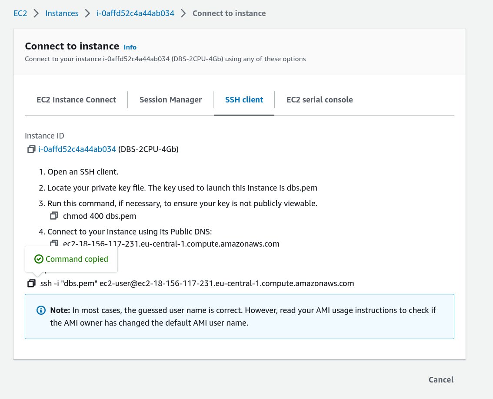

# Deploying DBConvert Streams (DBS) on Amazon EC2

This guide provides step-by-step instructions for deploying DBConvert Streams on Amazon EC2. The example demonstrates how to set up DBS to stream data from an Amazon RDS MySQL Binlog, using Change Data Capture (CDC), to an Amazon RDS PostgreSQL database.

## Preparing the environment.

### Step 1. Create Amazon EC2 instance. 
Follow the steps provided in the documentation at [https://stream.dbconvert.com/guide/deploy-ec2](https://stream.dbconvert.com/guide/deploy-ec2) to create an instance in Amazon Elastic Compute Cloud (EC2).

#### Connect to EC2.
Before installing MySQL and Postgres clients, connect to your EC2 instance.



Copy and paste the command into terminal to connect to your instance using its Public DNS via ssh. To connect to your instance using its Public DNS via SSH, copy and paste the following command into your terminal:

```bash
ssh -i "/path/to/your/key.pem" ec2-user@public-dns-name
```
Note that you will need to replace /path/to/your/key.pem with the file path to the private key file you used to launch the instance, and public-dns-name with the Public DNS of your instance. Also, make sure that the security group associated with the instance allows incoming SSH traffic on port 22.


To work with the data on Amazon RDS, you must install both MySQL and PostgreSQL clients.

#### Install MySQL Client.
Run the following command to install MySQL command-line client:

```bash
sudo yum install mariadb
```

For additional information on installing the MySQL client, you can refer to [this link](https://docs.aws.amazon.com/AmazonRDS/latest/UserGuide/USER_ConnectToInstance.html)

#### Install PostgreSQL Client.
To install the Postgres client, run the following command: 
```
sudo amazon-linux-extras install postgresql14
```

### Step 2. Create Amazon RDS MySQL database.
Please refer to the instructions provided at [https://stream.dbconvert.com/sources/mysql/amazon-rds ](https://stream.dbconvert.com/sources/mysql/amazon-rds) for creating an Amazon RDS MySQL instance.


#### Create database on the source.

First, connect to an EC2 instance using SSH. Once connected, use the following command to connect to the RDS MySQL source database:

```bash
mysql -h mysql-database.cssv1n52dnnd.eu-central-1.rds.amazonaws.com -u admin -p12345678
```
 This command will open a MySQL prompt. Next, create a database named source and use it as the current database:

```sql
CREATE DATABASE `source`;
USE `source`;
```

Finally, create a table named products in the source database with the following structure:

```sql
CREATE TABLE IF NOT EXISTS `products` (
  `id` BIGINT NOT NULL AUTO_INCREMENT,
  `name` VARCHAR(255) NOT NULL,
  `price` DECIMAL(10, 2) NOT NULL,
  `weight` DOUBLE NULL,
  `created` TIMESTAMP DEFAULT CURRENT_TIMESTAMP,
  PRIMARY KEY (`id`)
) ENGINE=InnoDB DEFAULT CHARSET=utf8mb4 COLLATE=utf8mb4_unicode_ci;
```

### Step 3. Create target  database (RDS PostgreSQL).
Creating an RDS PostgreSQL instance on AWS is a fairly straightforward process. You can follow the steps outlined in the [AWS documentation](https://docs.aws.amazon.com/AmazonRDS/latest/UserGuide/CHAP_GettingStarted.CreatingConnecting.PostgreSQL.html) to create and connect to a PostgreSQL instance on RDS.


## Execution.

### DBConvert Streams services.
The `docker-compose.yml` file specifies the following DBS services:
- `dbs-api`: This is the entry point for DBConvert Streams. Configuration settings for the source and target databases are sent to this service via requests.
- `dbs-source-reader`: This service monitors data changes in the source database and sends batches of records to the Event Hub.
- `dbs-target-writer`: This service receives changes from the Event Hub and uploads them to the target database.
- `nats`: This is the core of the Event Hub, providing communication between other DBS services.
- `prometheus`: This service monitors DBS service metrics.

### Step 1. Start services.

```bash
docker-compose up  --build -d
```

The command above starts the services listed in  `docker-compose.yml` file in the background.

Note that the command needs to be run in the same directory where the `docker-compose.yml` file is located.

### Step 2. Send stream configuration.

Send a request to the DBConvert Streams API with configuration parameters.  


```bash
curl --request POST --url http://127.0.0.1:8020/api/v1/streams\?file=./mysql2pg.json
```

### Step 3. Populate the source table with sample data.

To execute the SQL script that populates the source table with random sample data, you can run the following commands:

Connect to the RDS MySQL source database:

```bash
mysql -h mysql-database.cssv1n52dnnd.eu-central-1.rds.amazonaws.com -u admin -p12345678
```

In MySQL prompt, execute the following command

```sql
INSERT INTO products (name, price, weight)
SELECT
  CONCAT('Product', number) AS name,
  ROUND(RAND() * 100, 2) AS price,
  RAND() * 10 AS weight
FROM
  (SELECT @row := @row + 1 AS number FROM
    (SELECT 1 UNION SELECT 2 UNION SELECT 3 UNION SELECT 4 UNION SELECT 5 UNION SELECT 6
     UNION SELECT 7 UNION SELECT 8 UNION SELECT 9 UNION SELECT 10) t1,
    (SELECT 1 UNION SELECT 2 UNION SELECT 3 UNION SELECT 4 UNION SELECT 5 UNION SELECT 6
     UNION SELECT 7 UNION SELECT 8 UNION SELECT 9 UNION SELECT 10) t2,
    (SELECT 1 UNION SELECT 2 UNION SELECT 3 UNION SELECT 4 UNION SELECT 5 UNION SELECT 6
     UNION SELECT 7 UNION SELECT 8 UNION SELECT 9 UNION SELECT 10) t3,
    (SELECT 1 UNION SELECT 2 UNION SELECT 3 UNION SELECT 4 UNION SELECT 5 UNION SELECT 6
     UNION SELECT 7 UNION SELECT 8 UNION SELECT 9 UNION SELECT 10) t4,
    (SELECT 1 UNION SELECT 2 UNION SELECT 3 UNION SELECT 4 UNION SELECT 5 UNION SELECT 6
     UNION SELECT 7 UNION SELECT 8 UNION SELECT 9 UNION SELECT 10) t5,
    (SELECT 1 UNION SELECT 2 UNION SELECT 3 UNION SELECT 4 UNION SELECT 5 UNION SELECT 6
     UNION SELECT 7 UNION SELECT 8 UNION SELECT 9 UNION SELECT 10) t6,
    (SELECT @row := 0) r
  ) numbers
LIMIT 1000000;
```

### Step 4. Control the process. 
In the next AWS EC2 terminal run the following command to control the process.  

```bash
watch -n 1 'curl --request GET --url http://0.0.0.0:8020/api/v1/streams/stat | jq' 
```

This command monitors the status of an API stream by repeatedly fetching and parsing the data every second from the stream using the `curl` and `jq` tools.

#### Check the number of records on the target.
Additionally, check the count of records on the target PostgreSQL DB.

Run this command to connect to AWS RDS Postgres DB:

```bash
psql \
   --host=postgres-database.cssv1n52dnnd.eu-central-1.rds.amazonaws.com \
   --port=5432 \
   --username=postgres \
   --password \
   --dbname=postgres 
```

In the PostgreSQL prompt run the command: 
```sql
"SELECT COUNT(*) FROM products;"
```

### Stop the demo
```
docker compose down --remove-orphans
```