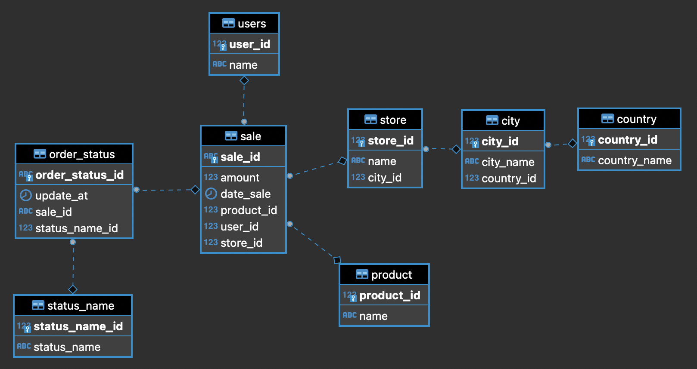

# MySQL to PostgreSQL streaming example.

This example shows how to set up DBConvert Streams for streaming data from a MySQL Binlog using Change Data Capture (CDC) to a PostgreSQL database.
Let's take a look at the `docker-compose.yml` file.

## DBConvert Streams services.

- `dbs-api` service is the entry point of DBConvert Streams. We will send requests there with configuration settings for the source and target databases.
- `dbs-source-reader` service monitors data changes in the source database and sends batches of records to the Event Hub.
- `dbs-target-writer` service is used to receive changes from the Event Hub and upload them to the target database.
- `nats` service is the core of the Event Hub. It provides communication between other DBS services.
- `prometheus` - service for monitoring DBS services metrics.

## Database services.

### Entity Relationship (ER) Diagram of Database.

The structure of tables is shown on the diagram below.


The structure of MySQL source tables is identical to the one from the
[jdaarevalo/docker_postgres_with_data](https://github.com/jdaarevalo/docker_postgres_with_data) GitHub repository.

### Source and Target Databases.

`mysql-source` database image is based on `slotix/dbs-mysql:8`, which has all the necessary settings to enable MySQL CDC replication. This image also contains the `initdb.sql` script, which creates tables with the above structures.

`postgres-target` database is based on the official `postgres:15-alpine` image. `postgres-target` database will receive all changes made to the `mysql-source` database.

Both of these databases are usually on different physical servers in a production environment. But in our example, we will run them on the same machine in different containers.

## Execution.

### Step 1. Start services.

```bash
docker-compose up  --build -d
```

The docker-compose up command is used to start and run all the services defined in the 'docker-compose.yml' file.

The command above will start the services in the background, build the images and use the docker-compose.yml file to configure the services.

Note that the command needs to be ran in the same directory where the docker-compose.yml file is located.

### Step 2. Send stream configuration.

Send a request to the DBConvert Streams API with configuration parameters.  
You can either send the request using `curl` in a containerized environment or using `curl` installed locally.

To send the request using containerized `curl`, run the following command:

```bash
docker run -it --rm \
    --network sales-db_default \
    curlimages/curl  \
    --request POST \
    --url http://dbs-api:8020/api/v1/streams\?file=./mysql2pg.json
```

To send the request using curl installed locally, you can simply run the `curl` command without the `docker run` command.

```
curl --request POST --url http://127.0.0.1:8020/api/v1/streams\?file=./mysql2pg.json
```

### Step 3. Populate source tables with sample data.

The Variables at the top of `fill_tables.sql` file are used to specify the number of rows to create in the corresponding table.

To execute the SQL script that populates the source tables with sample data, you can run either of the following commands:

```bash
docker exec -i \
    mysql-source \
    mysql -uroot -p123456 -D source < $PWD/fill_tables.sql
```

Or

```bash
docker run -i --rm  \
    --network sales-db_default \
    mysql:8.0 \
    mysql -h mysql-source -uroot -p123456 -D source -B < $PWD/fill_tables.sql
```
